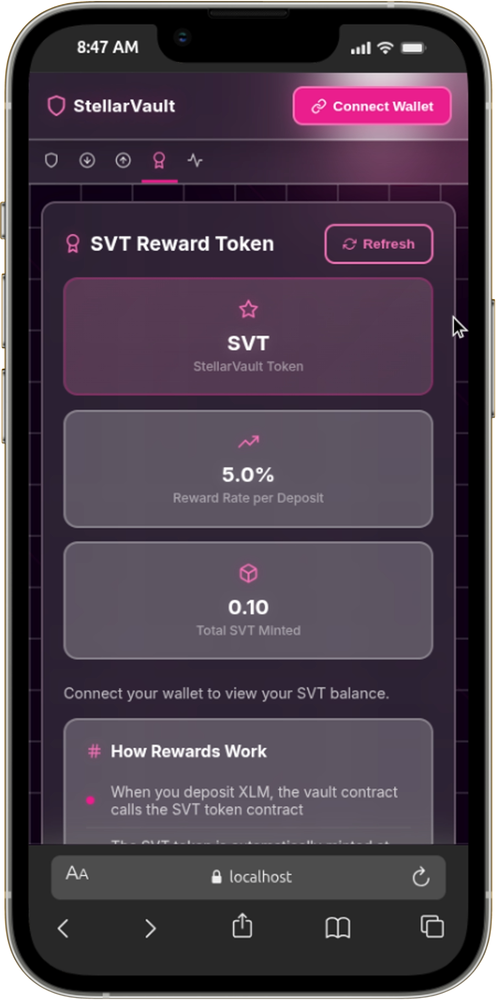
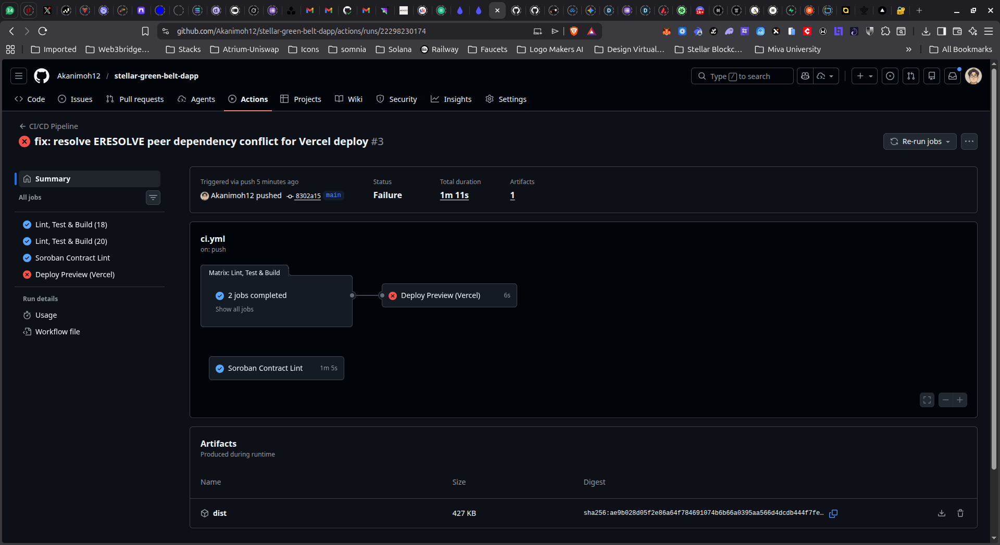

# StellarVault — Green Belt dApp (Level 4)

[](https://github.com/Akanimoh12/stellar-green-belt-dapp/actions/workflows/ci.yml)

A production-grade **Stellar Soroban Token Vault** with **inter-contract calls**, a **custom SVT reward token**, CI/CD pipeline, and mobile-responsive design. Built for the Stellar Development Foundation Green Belt Challenge.

> **Live Demo**: [https://stellar-green-belt-dapp.vercel.app/](https://stellar-green-belt-dapp.vercel.app/)

> **Deployed Contracts**: 
Vault:(`CB4WTU6F45BHCEQBBBS7P5RXEFWD5ELMO3XTWEGDRVV3NS5DDZF6QBSN`), 
SVT Token (`CABSDKREP4SBIHCIAOPSL2O5DL575N44ZAAUNFXUV2YN7UYSOX5AONWX`)

> **Video Demo**: [Video Walkthrough](https://www.loom.com/share/148a3b0638714fb1962fc31a70445c73)

> **Mobile Screenshot**
> 

> **Screenshot or badge: CI/CD pipeline running**
> 
> 

---

## Features

### Core Vault (from Orange Belt)
- Deposit & withdraw XLM via Soroban smart contract
- Per-wallet balance tracking on-chain
- Timelock functionality with expiry countdown
- Multi-wallet support (Freighter, xBull, Albedo)
- Real-time event feed (Soroban event polling)

### Green Belt Additions
- **Custom SVT Token**: ERC-20-style token contract with mint/transfer/burn
- **Inter-Contract Calls**: Vault contract calls SVT token contract to mint rewards on deposit
- **Reward System**: 5% SVT minted per XLM deposited (500 basis points)
- **Rewards Tab**: View SVT balance, token stats, reward rate, contract addresses
- **CI/CD Pipeline**: GitHub Actions — lint, test, build (Node 18 & 20) + Soroban contract check
- **Mobile Responsive**: Touch-friendly targets, breakpoints at 768/640/480px, iOS zoom prevention

---

## Architecture

```
┌─────────────────────────────────────────────────────┐
│                    Frontend (React)                  │
│  Vault Tab │ Deposit Tab │ Withdraw │ Rewards │ Feed│
└─────────┬───────────────────────────┬───────────────┘
          │                           │
          ▼                           ▼
┌─────────────────┐         ┌─────────────────────┐
│  Vault Contract │────────▶│  SVT Token Contract │
│  (deposit/lock) │  inter- │  (mint/transfer/burn)│
│                 │  contract│                     │
│  - deposit()    │  call    │  - mint()           │
│  - withdraw()   │─────────│  - balance()        │
│  - set_timelock │         │  - total_supply()   │
│  - set_reward() │         │  - set_minter()     │
└─────────────────┘         └─────────────────────┘
```

### Inter-Contract Call Flow
1. User calls `deposit(amount)` on the **Vault contract**
2. Vault stores XLM and emits a deposit event
3. Vault reads its `RewardToken` and `RewardRate` config
4. Vault calculates `reward = amount × rate / 10000`
5. Vault calls `env.invoke_contract()` → **SVT Token's `mint(user, reward)`**
6. SVT Token verifies the caller (Vault) is the authorized minter
7. SVT tokens appear in the user's balance automatically

---

## Deployed Contracts (Stellar Testnet)

| Contract | Address |
|----------|---------|
| **Vault** | `CB4WTU6F45BHCEQBBBS7P5RXEFWD5ELMO3XTWEGDRVV3NS5DDZF6QBSN` |
| **SVT Token** | `CABSDKREP4SBIHCIAOPSL2O5DL575N44ZAAUNFXUV2YN7UYSOX5AONWX` |
| **XLM SAC** | `CDLZFC3SYJYDZT7K67VZ75HPJVIEUVNIXF47ZG2FB2RMQQVU2HHGCYSC` |
| **Admin** | `GDHQ6TNWZ4V2JVCDWEUVW7YKFBXCOQZRRUCT27LAKES3PGOE6JSZMSMD` |

**Reward Rate**: 500 basis points (5% SVT per XLM deposited)

---

## Tech Stack

| Layer | Technology |
|-------|-----------|
| Frontend | React 18 + TypeScript + Vite 4 |
| Testing | Vitest + @testing-library/react + jsdom |
| Smart Contracts | Soroban (Rust) with soroban-sdk 20.3.1 |
| Wallet | @creit.tech/stellar-wallets-kit (Freighter, xBull, Albedo) |
| Blockchain SDK | @stellar/stellar-sdk 11.3.0 |
| CI/CD | GitHub Actions (Node 18/20 matrix + Rust contract check) |
| Deployment | Vercel |

---

## Project Structure

```
stellar-green-belt-dapp/
├── .github/workflows/ci.yml    # CI/CD pipeline
├── contracts/
│   ├── token/src/              # SVT reward token contract (Rust)
│   │   ├── lib.rs              # Token: mint, transfer, burn, set_minter
│   │   └── test.rs             # 10 Rust unit tests
│   └── vault/src/              # Vault contract with inter-contract calls
│       ├── lib.rs              # Deposit + auto SVT mint, withdraw, timelock
│       └── test.rs             # Vault unit tests
├── src/
│   ├── components/
│   │   ├── TokenInfo.tsx       # SVT token stats & reward info (NEW)
│   │   ├── VaultDashboard.tsx  # Vault overview + SVT balance
│   │   ├── DepositForm.tsx     # Deposit with reward preview
│   │   ├── WithdrawPanel.tsx   # Withdraw + timelock
│   │   ├── EventFeed.tsx       # Live Soroban event feed
│   │   └── WalletConnect.tsx   # Multi-wallet modal
│   ├── hooks/
│   │   ├── useToken.ts         # SVT token data hook (NEW)
│   │   ├── useVault.ts         # Vault info hook
│   │   ├── useDeposit.ts       # Deposit action hook
│   │   └── useWithdraw.ts      # Withdraw action hook
│   ├── services/
│   │   ├── contract.ts         # Soroban contract calls (vault + SVT)
│   │   ├── cache.ts            # TTL localStorage cache
│   │   └── events.ts           # Soroban event polling
│   ├── config/network.ts       # Contract IDs, network config
│   ├── types/index.ts          # TypeScript interfaces
│   ├── utils/helpers.tsx       # formatXLM, calculateReward, UI components
│   ├── __tests__/              # 38+ Vitest tests
│   ├── App.tsx                 # 5-tab layout with Rewards tab
│   └── index.css               # Mobile-responsive CSS
├── package.json
├── vite.config.ts
└── vitest.config.ts
```

---

## Getting Started

### Prerequisites
- Node.js 18+
- Stellar CLI (optional — for contract deployment)

### Setup
```bash
cd stellar-green-belt-dapp
npm install
npm run dev        # Start dev server at http://localhost:5173
```

### Test
```bash
npm test           # Run all Vitest tests
```

### Build
```bash
npm run build      # Production bundle in dist/
```

---

## Testing

**38+ tests** across 3 test suites:

| Suite | Tests | Coverage |
|-------|-------|----------|
| `helpers.test.ts` | 27 | formatXLM, truncateAddress, isValidAmount, timeUntil, calculateReward, bpsToPercent |
| `cache.test.ts` | 7 | TTL cache: get/set/invalidate/types |
| `App.test.tsx` | 4 | Renders title, badge, 5 tabs, footer |

Run with verbose output:
```bash
npm test -- --reporter=verbose
```

---

## Mobile Responsive Design

The dApp is fully responsive across all breakpoints:

| Breakpoint | Layout Changes |
|-----------|---------------|
| **768px** | 4-col stats → 2-col, split layout → single |
| **640px** | Tab labels hidden (icons only), smaller cards |
| **480px** | All grids → single column, compact controls |
| **Touch** | Min 44px touch targets, 16px inputs (no iOS zoom) |


---

## CI/CD Pipeline

The GitHub Actions pipeline runs on every push to `main`/`develop` and on PRs:

1. **Lint, Test & Build** — Node 18 & 20 matrix
   - `npm ci` → `npm test` → `npm run build`
2. **Soroban Contract Check** — Rust toolchain
   - `cargo check --target wasm32-unknown-unknown` for both contracts
3. **Deploy Preview** — Vercel deployment on main branch push

---

## Smart Contracts

### SVT Token Contract (`contracts/token/`)
Custom Soroban token with:
- `initialize(admin, name, symbol, decimals)` — One-time setup
- `set_minter(minter)` — Admin sets authorized minter (the Vault)
- `mint(to, amount)` — Minter-only; creates new tokens
- `transfer(from, to, amount)` — Standard transfer with auth
- `burn(from, amount)` — Destroy tokens
- `balance(addr)`, `total_supply()`, `name()`, `symbol()`, `decimals()`

**10 Rust tests**: initialize, double-init prevention, admin mint, minter mint, transfer, insufficient funds, burn, minter query, accumulation.

### Vault Contract (`contracts/vault/`)
Enhanced from Orange Belt with inter-contract reward system:
- `deposit(user, amount)` — Deposit XLM + **auto-mint SVT via inter-contract call**
- `withdraw(user, amount)` — Withdraw XLM (respects timelock)
- `set_timelock(user, unlock_time)` — Lock funds until timestamp
- `set_reward_config(reward_token, rate)` — Admin-only: configure rewards
- `get_reward_info()` — Read reward token address + rate

---


## License

MIT

---

**Built for the Stellar Development Foundation Green Belt (Level 4) Challenge**
